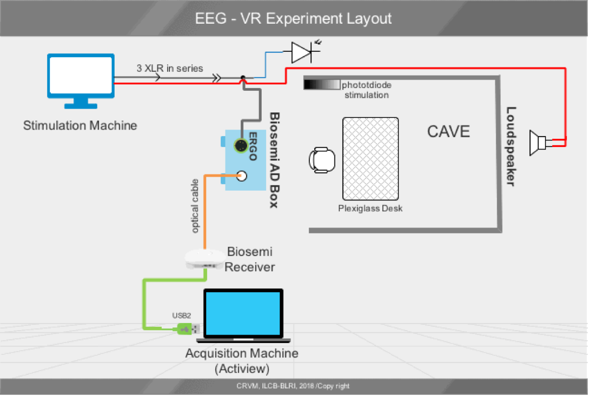

# Embodiment-EEG-VR
The role of premotor activity in action word processing : A combined EEG and Virtual Reality Study.

Figure of the experimental protocol that was put in place to combine EEG and fully immersive virtual reality system (CAVE VR environment)

